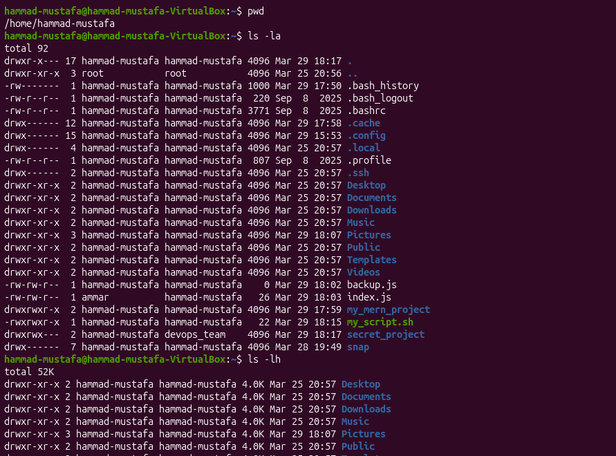
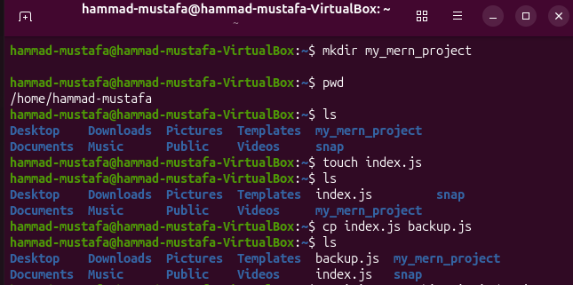
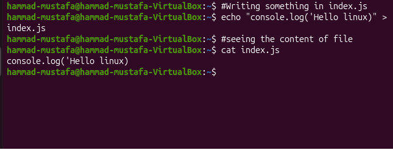
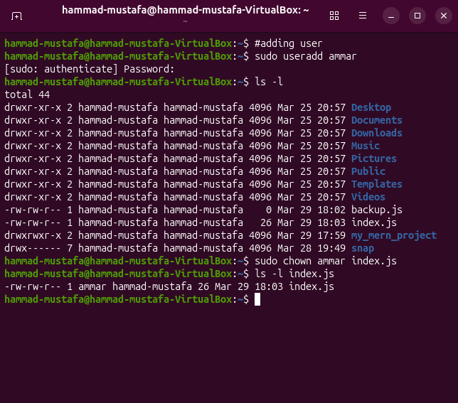
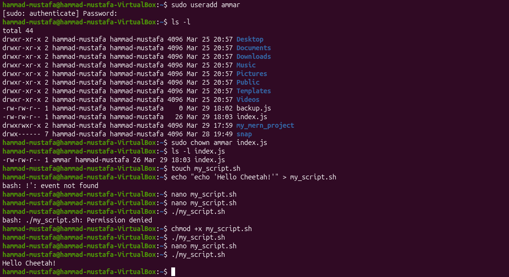
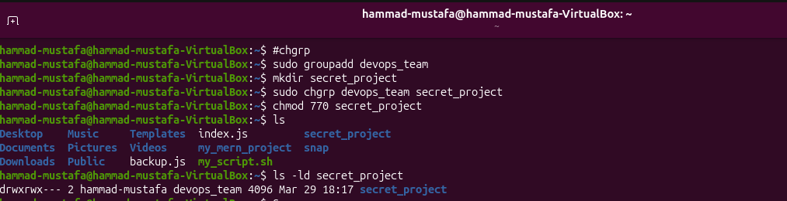

# 🐧 Linux Basics Lab (Step-by-Step with Screenshots)

This lab covers essential Linux commands with **real terminal outputs (screenshots)** so you can learn visually.

---

#  Phase 1: Basic Commands

---

## 🔹 Step 1: Navigation & Listing

### 🧾 Commands

```bash
pwd
ls -la
ls -lh
```

### 📖 What’s Happening?

* `pwd` → shows current directory
* `ls -la` → detailed list with permissions
* `ls -lh` → file sizes in readable format

### 📸 Output



---

## 🔹 Step 2: File & Folder Creation

### 🧾 Commands

```bash
mkdir my_mern_project
touch index.js
cp index.js backup.js
ls -l
```

### 📖 What’s Happening?

* Folder created
* File created
* File copied
* Verified using `ls -l`

### 📸 Output



---

## 🔹 Step 3: Writing & Reading File Content

### 🧾 Commands

```bash
echo "console.log('Hello Linux')" > index.js
cat index.js
```

### 📖 What’s Happening?

* `echo` writes into file
* `cat` reads file content

### 📸 Output



---

# 🔐 Phase 2: Permissions & Ownership

---

## 🧠 Understanding File Ownership

Example:

```bash
-rw-rw-r-- 1 user user file.txt
```

* First `user` → Owner
* Second `user` → Group

---

## 🔹 Task 1: Change Ownership

### 🧾 Commands

```bash
sudo useradd ammar
touch secret.txt
ls -l secret.txt
sudo chown ammar secret.txt
ls -l secret.txt
```

### 📖 What’s Happening?

* File initially belongs to current user
* After `chown` → owner becomes **ammar**

### 📸 Output



---

## 🔹 Extra: Ownership Practice

### 🧾 Command

```bash
sudo chown ammar index.js
```

### 📸 Output


---

## 🔹 Task 2: Fix Permission Error

### 🧾 Commands

```bash
touch my_script.sh
echo "echo Hello DevOps" > my_script.sh
./my_script.sh
chmod +x my_script.sh
./my_script.sh
```

### 📖 What’s Happening?

* First run → ❌ Permission Denied
* After `chmod +x` → ✅ Script runs

### 📸 Output



---

## 🔹 Extra: chmod Practice

### 🧾 Command

```bash
chmod +x my_script.sh
```

### 📸 Output


---

## 🔹 Task 3: Group-Based Access

### 🧾 Commands

```bash
sudo groupadd dev_team
mkdir project_folder
sudo chgrp dev_team project_folder
chmod 770 project_folder
ls -ld project_folder
```

### 📖 What’s Happening?

* Group assigned to folder
* Permission `770` means:

  * Owner → full access
  * Group → full access
  * Others → no access

### 📸 Output



---

## 🔹 Extra: Team Lab

### 🧾 Commands

```bash
sudo groupadd devops_team
mkdir secret_project
sudo chgrp devops_team secret_project
chmod 770 secret_project
ls -ld secret_project
```

### 📸 Output


---

# 🎯 What You Learned

* Linux navigation
* File handling
* Writing & reading files
* Ownership control
* Fixing permission errors
* Team-based security

---

# 🧑‍💻 Author

**Hammad Mustafa**
Software Engineer

---

🔥 Tip: Always practice commands yourself — screenshots help, but real learning comes from doing.
